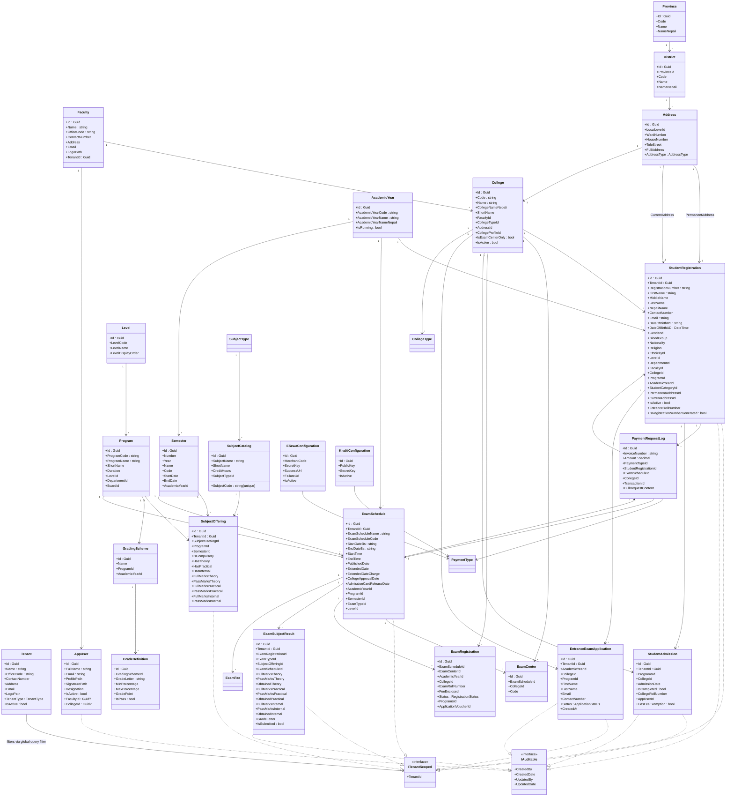
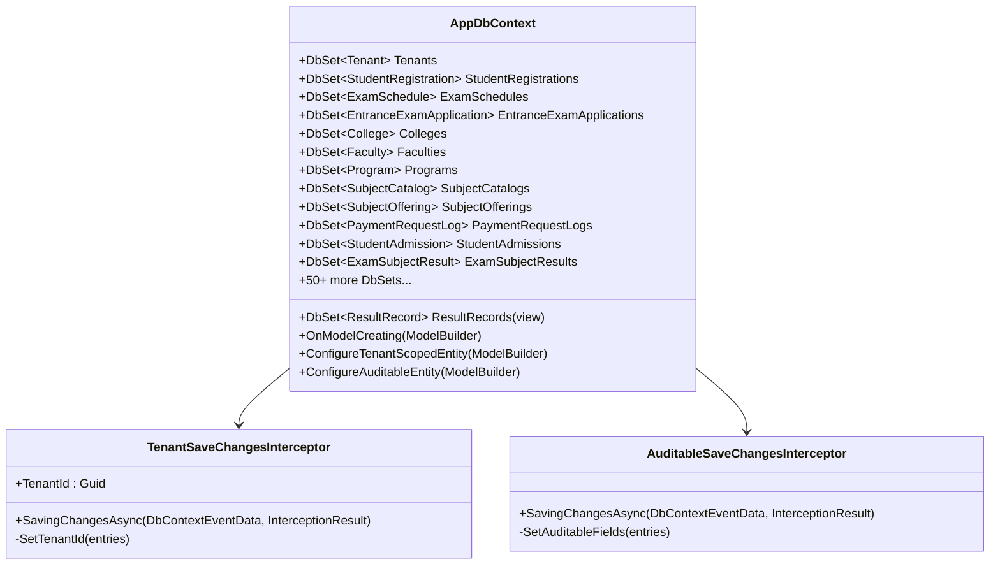

# FWU Exam Management System - Class Diagram

## High-Level Class Diagram



## Layer Architecture

```mermaid
classDiagram
    class Domain {
        <<FWU.Exam.Management.Domain>>
        +Entities/
        +Enums/
        +Interfaces/
    }
    class Application {
        <<FWU.Exam.Management.Application>>
        +DTOs/
        +Interfaces/ (Service Interfaces)
    }
    class Infrastructure {
        <<FWU.Exam.Management.Infrastructure>>
        +Data/AppDbContext
        +Data/Models/AppUser
        +Services/
        +Interceptor/
    }
    class Web {
        <<FWU.Exam.Management.Web>>
        +Controllers/
        +Areas/
        +Middleware/
        +ViewModels/
        +Views/
    }
    class Api {
        <<FWU.Exam.Management.Api>>
        (stub/empty)
    }

    Domain <-- Application : depends on
    Domain <-- Infrastructure : depends on
    Application <-- Infrastructure : depends on
    Application <-- Web : depends on
    Infrastructure <-- Web : depends on
    Domain <-- Api : depends on
    Application <-- Api : depends on
```

## Key Interfaces & Implementations

```mermaid
classDiagram
    class IStudentRegistrationService {
        <<interface>>
        +CreateStudentRegistrationAsync(dto)
        +UpdateStudentRegistrationAsync(id, dto)
        +GetAllStudentRegistrationsAsync()
        +GetPagedDataAsync(params)
        +GetSelectListDataAsync()
        +UpdateStatusAsync(id, status)
    }

    class StudentRegistrationService {
        +CreateStudentRegistrationAsync(dto)
        +UpdateStudentRegistrationAsync(id, dto)
        +GetAllStudentRegistrationsAsync()
        +GetPagedDataAsync(params)
        +GetSelectListDataAsync()
        +UpdateStatusAsync(id, status)
        -EnsureStudentAppUserAsync(email, name, facultyId, collegeId, dob)
    }

    class IEntranceExamApplicationService {
        <<interface>>
        +SubmitApplicationAsync(dto)
        +ReviewApplicationAsync(id, status)
        +GetPagedApplicationsAsync(params)
        +GetSelectListsAsync()
    }

    class EntranceExamApplicationService {
        +SubmitApplicationAsync(dto)
        +ReviewApplicationAsync(id, status)
        +GetPagedApplicationsAsync(params)
        +GetSelectListsAsync()
    }

    class IStudentDashboardService {
        <<interface>>
        +GetStudentRegistrationByEmailAsync(email)
        +GetExamSchedulesForStudentAsync(email)
        +GetExamFeeForScheduleAsync(scheduleId)
        +CreatePaymentRequestLogAsync(dto)
        +GetFailedSubjectOfferingIdsAsync(email, scheduleId)
        +GetResultRecordsAsync(email, scheduleId)
    }

    class StudentDashboardService {
        +GetStudentRegistrationByEmailAsync(email)
        +GetExamSchedulesForStudentAsync(email)
        +GetExamFeeForScheduleAsync(scheduleId)
        +CreatePaymentRequestLogAsync(dto)
        +GetFailedSubjectOfferingIdsAsync(email, scheduleId)
        +GetResultRecordsAsync(email, scheduleId)
    }

    class IESewaService {
        <<interface>>
        +GeneratePaymentFormData(amount, invoice)
        +VerifyTransactionAsync(refId)
        +VerifyResponseSignature(data)
    }

    class ESewaService {
        +GeneratePaymentFormData(amount, invoice)
        +VerifyTransactionAsync(refId)
        +VerifyResponseSignature(data)
    }

    class IKhaltiService {
        <<interface>>
        +InitiatePaymentAsync(amount, invoice, returnUrl)
        +LookupPaymentAsync(transactionId)
    }

    class KhaltiService {
        +InitiatePaymentAsync(amount, invoice, returnUrl)
        +LookupPaymentAsync(transactionId)
    }

    class ITenantContext {
        <<interface>>
        +CurrentTenant : Tenant
        +TenantId : Guid
    }

    class TenantContext {
        +CurrentTenant : Tenant
        +TenantId : Guid
    }

    class IAuditUserProvider {
        <<interface>>
        +GetCurrentUserName() : string
    }

    class HttpContextAuditUserProvider {
        +GetCurrentUserName() : string
    }

    class IFacultyResolver {
        <<interface>>
        +ResolveFacultyAsync(hostname) : Faculty
    }

    class FacultyResolver {
        +ResolveFacultyAsync(hostname) : Faculty
    }

    IStudentRegistrationService <|.. StudentRegistrationService
    IEntranceExamApplicationService <|.. EntranceExamApplicationService
    IStudentDashboardService <|.. StudentDashboardService
    IESewaService <|.. ESewaService
    IKhaltiService <|.. KhaltiService
    ITenantContext <|.. TenantContext
    IAuditUserProvider <|.. HttpContextAuditUserProvider
    IFacultyResolver <|.. FacultyResolver
```



## DbContext & Interceptors


