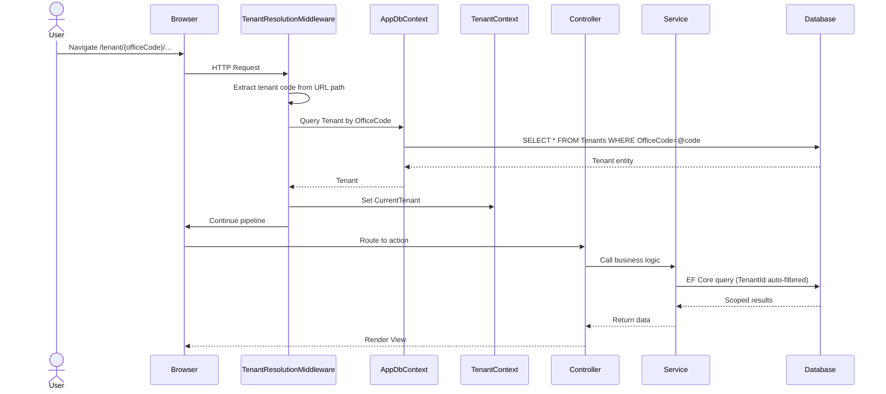
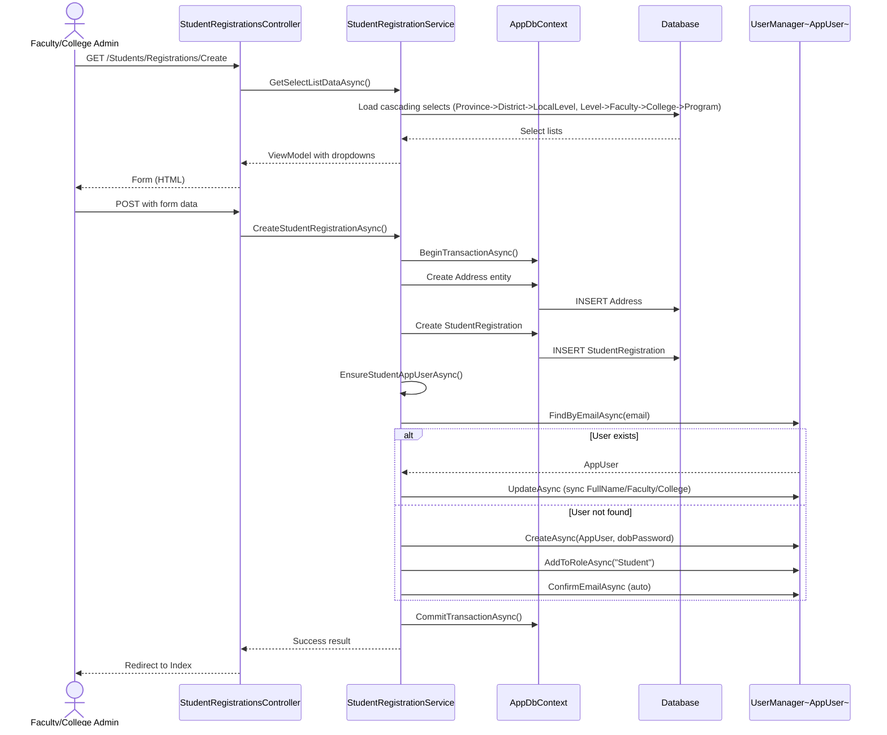
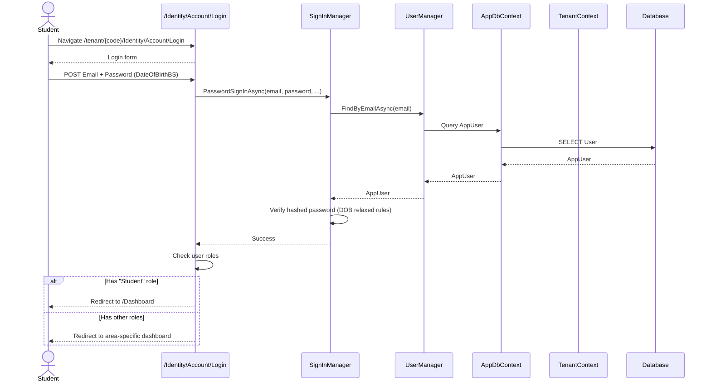
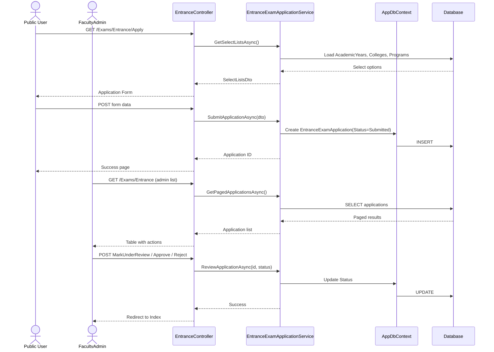
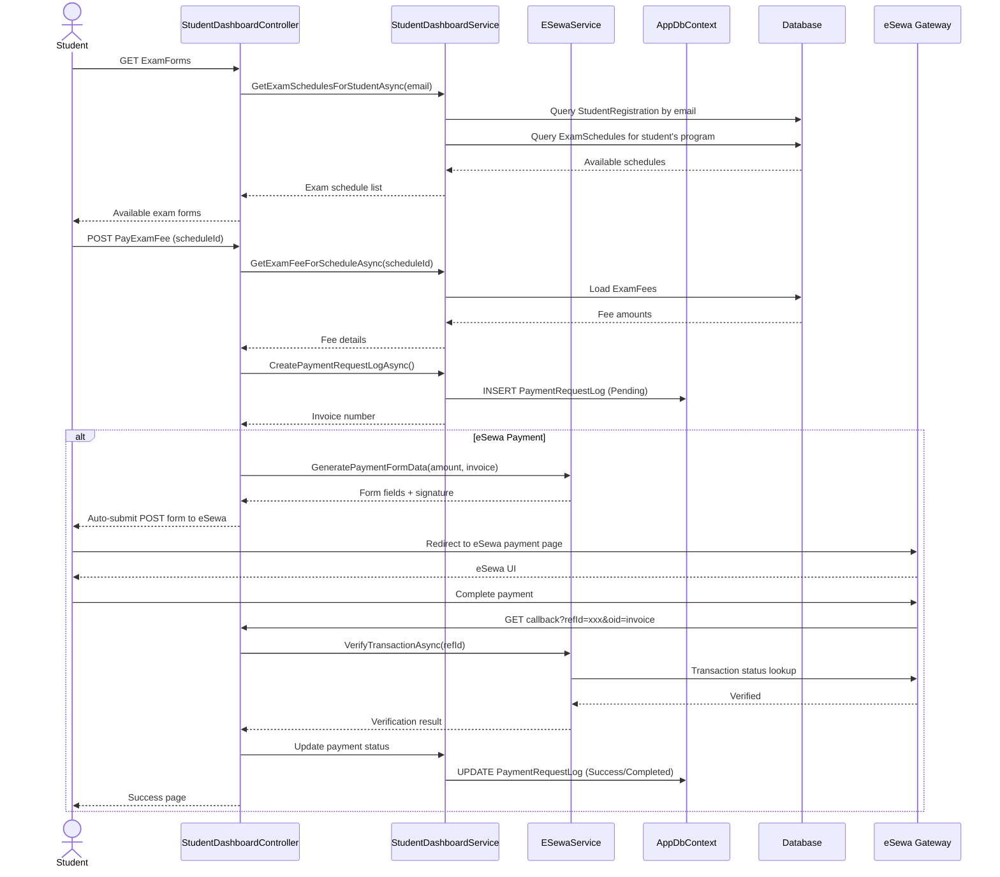

# FWU Exam Management System - Sequence Diagrams

## 1. Multi-Tenant Request Flow

## 2. Student Registration Flow

## 3. Student Login Flow

## 4. Entrance Exam Application (Public) + Admin Review

## 5. Exam Registration & eSewa Payment Flow

